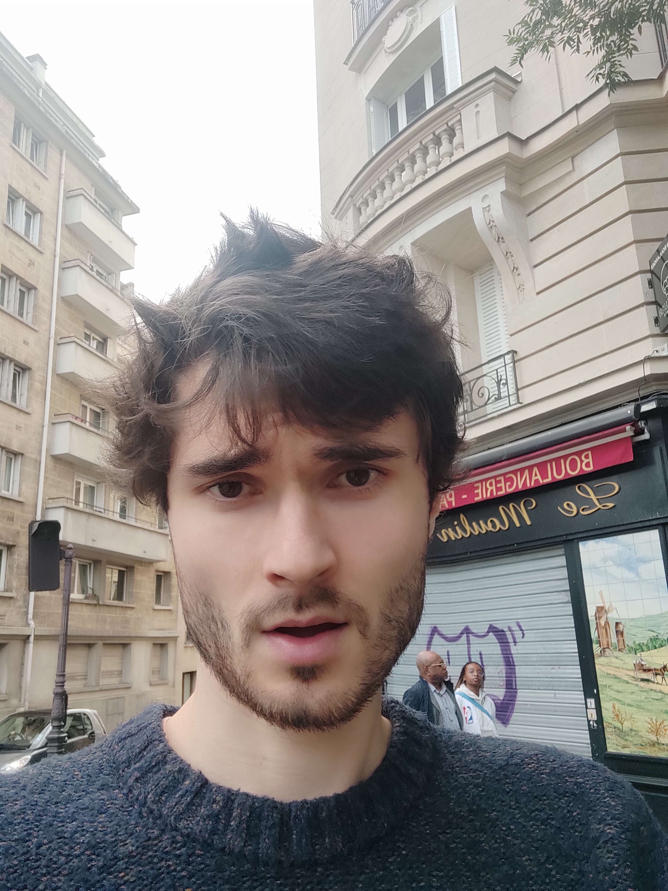

  

    <h1 style="margin: 0;">Thomas GAUTIER</h1>
    <h4 style="margin: 0;">Ingénieur en micro-électronique numérique</h4>
  

  

    
  

## Expériences

### Mipsology (AMD) / Novembre 2019 - Aujourd'hui

Conception d'un accélérateur matériel de calculs matriciels sur les cartes Versal (FPGA + CPU + matrice d'AIE) de Xilinx (depuis 2021) :
* Architecture
* Programmation de la matrice d'AI Engines
* Optimisation de performances AIE à partir de l'étude de l'assembleur
* Mise en place d'un flow de vérification pour la matrice d'AIE
* Mise en place d'un flow de synthèse adapté à Versal

Mise en place, maintenance et évolution du flow et des outils d'une équipe FW (depuis 2021)

Conception de modules RTL pour un accélérateur de calculs matriciels sur FPGA (Ultrascale+) (1 an)

**Compétences mises en oeuvre :** Python, C, AIE, Versal, Git, System Verilog 

### Elsys Design / Octobre 2016 - Novembre 2019

#### Biologic (2 ans et 6 mois)

Architecte et Designer FPGA (seul compétence FPGA de l'équipe)
* Intégration d'une équipe firmware sur un projet de développement d'un cycleur de batterie
* En charge du développement et de l'intégration FPGA sur le projet
* Développement d'un SoC autour d'un microblaze avec de multiples périphériques (DMA, MIG, IPs propriétaires, ...)
* Développement et intégration de plusieurs IPs propriétaires (liaison SPI, Séquenceur de pilotage et d'acquisition de batterie incluant des unités de calculs flottantes, bus de communication rapide, ...)
* Portage de l'architecture SoC Microblaze sur un Zynq
* Mise en place d'une architecture de simulation et de synthèse VHDL à partir de scripts bash
* Ébauche de testbenchs automatiques dans une optique d'intégration continue à l'aide de scripts Python
* Implication dans l'écriture de drivers C pour le FPGA

**Compétences mises en oeuvre :** VHDL, FPGA, Vivado, MicroBlaze, Zynq, C, Python, Git  

#### Pyxalis (4 mois)

Développement de la partie numérique d'un convertisseur analogique-numérique (ASIC)  

Amélioration d'une interface entre un PC et un convertisseur analogique-numérique (FPGA)  

Modification d'une plateforme FPGA de caractérisation de pixels (FPGA)  

**Compétences mises en oeuvre :** VHDL, FPGA, Vivado, Zynq, C, Python  

### Centre de Physique des particules de Marseille (Stage) / Février 2016 - Août 2016

Développement de firmware pour une carte FPGA dernière génération (ARRIA 10) à destination du détecteur de particules ATLAS (LHC - CERN).  
* Projet collaboratif mené par 7 laboratoires de nationalités différentes.  
* Traitement de données à grande vitesse (40 fibres optiques à 5.12 Gbps en entrée du FPGA).  

**Compétences mises en oeuvre :** VHDL, FPGA, Altera  

### Tiempo SAS (Stage) / Mai 2015 - Août 2015

Stage : Développement d'une application de visualisation de données.  
* Lien étroit avec le test de cartes à puce asynchrones.  

**Compétences mises en oeuvre :** R  

## Formation

### Grenoble INP Phelma / 2013 - 2016

Master en Microélectronique numérique
- Option Systèmes électroniques intégrés
- Option Système sur puce

### Lycée Jean Perrin / 2011 - 2013

Classe préparatoire aux grandes écoles
- Option Physique-Chimie

### Externat Sainte Marie La Verpillière

Baccalauréat Scientifique
- Mention Bien

## Compétences

| Compétence | Aisance (de 1 à 5) | Commentaires |
|-|-|-|
| VHDL | 4 | Non pratiqué depuis 5 ans |
| C | 4 |  |
| Assembleur | 4 |  |
| Python | 4 |  |
| Django (Python web framework) | 4 | Sur des projets personnels |
| Vivado, Vitis | 4 | Outils Xilinx |
| Git | 4 |  |
| Systèmes embarqués | 3 |  |
| System Verilog | 2 | Non pratiqué depuis 4 ans |
| Intelligence artificielle | 2 | Particulièrement sur les réseaux convolutionnels |
| HTML, CSS, Javascript | 1 | Sur des projets personnels |
| SVN | 1 | Non pratiqué depuis 7 ans |
| C++ | 1 |  |

## Centres d'intérêt